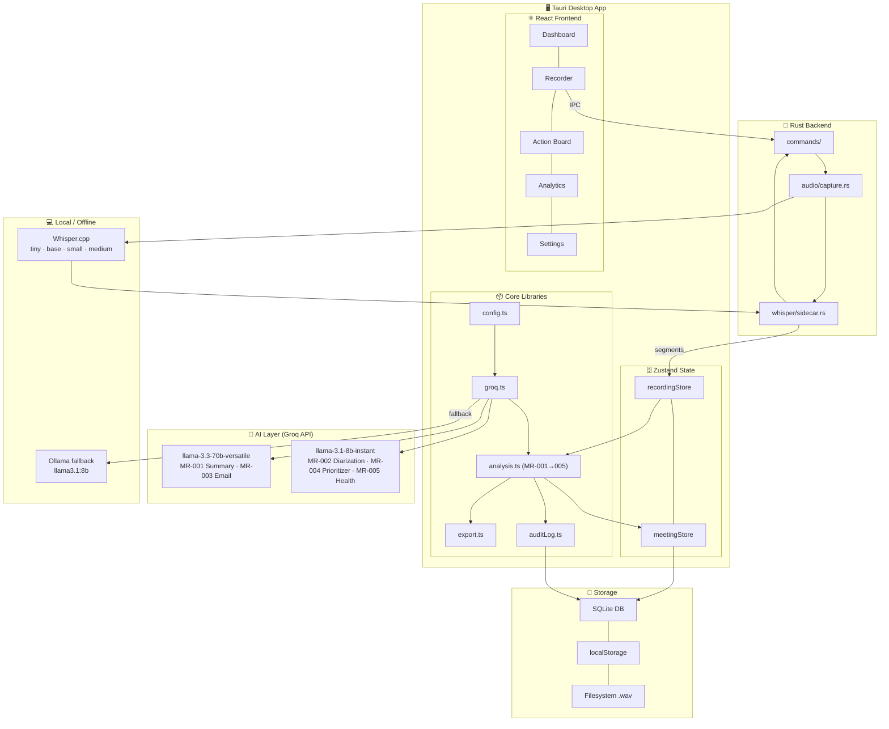

<h1 align="center">
  <br />
  MeetingAI Enterprise
  <br />
</h1>

<h4 align="center">
  AI-powered meeting recorder &amp; action tracker.<br />
  Built by <a href="http://devoradevs.xyz/" target="_blank"><strong>Devora Devs</strong></a> · Enterprise Edition
</h4>

<p align="center">
  
  
  
  
  
  
</p>

---

## ✨ What Is This?

**MeetingAI Enterprise** records any meeting (Google Meet, Zoom, Teams, in-person), transcribes it **locally** using Whisper.cpp, then uses **Groq API free-tier** to:

- 📋 Extract every action item with owner, due date, and priority
- 🏆 Score decisions and meeting effectiveness (1–10)
- ✉️ Draft professional follow-up emails instantly
- 📊 Track action items on a Kanban board
- 🔐 Audit-log every action (SOC2/GDPR enterprise ready)
- 📤 Export to Markdown, Notion, or Slack in one click

> **Privacy first** — audio never leaves your machine. Groq API only receives transcript text, never audio.

---

## 🏗️ System Architecture



---

## ⚡ 5 AI Pipelines

| Pipeline | Prompt | Groq Model | Trigger |
|---|---|---|---|
| **MR-001** Meeting Summary & Actions | Expert analyst | `llama-3.3-70b-versatile` | Recording stops |
| **MR-002** Speaker Diarization | Transcript cleanup | `llama-3.1-8b-instant` | Pre-analysis |
| **MR-003** Follow-up Email | Exec comms | `llama-3.3-70b-versatile` | User request |
| **MR-004** Action Prioritizer | Daily coach | `llama-3.1-8b-instant` | Morning open |
| **MR-005** Meeting Health Score | Effectiveness consultant | `llama-3.1-8b-instant` | Post-meeting |

> All models swappable via `.env` — zero code changes.

---

## 🚀 Quick Start

### Prerequisites

| Tool | Version | Notes |
|---|---|---|
| **Node.js** | 18+ | [nodejs.org](https://nodejs.org) |
| **Rust** | 1.80+ | `rustup install stable` |
| **VS C++ Build Tools** | 2019+ | See fix below ↓ |
| **Groq API Key** | Free | [console.groq.com](https://console.groq.com) |

```bash
git clone https://github.com/devoradevs/meeting-recorder-ai.git
cd meeting-recorder-ai/meeting-recorder
npm install
cp .env.example .env   # Add your VITE_GROQ_API_KEY
```

### Run (two options)

```bash
# Option A — Web browser (works immediately, no Rust needed)
npm run dev
# → http://localhost:1420

# Option B — Desktop app (requires VS Build Tools)
npm run tauri dev
```

---

## 🔧 Fix: `link.exe` Not Found (Windows)

> This is the most common setup issue on Windows.

1. Download **[Build Tools for Visual Studio 2022](https://visualstudio.microsoft.com/downloads/#build-tools-for-visual-studio-2022)**
2. Run installer → select **"Desktop development with C++"** → Install
3. Restart terminal → run `npm run tauri dev`

> Takes ~5–10 min. Until then, use `npm run dev` (browser version works fully).

---

## ⚙️ Environment Variables

```env
# ── REQUIRED ───────────────────────────────────────────────────
VITE_GROQ_API_KEY=gsk_your_key_here      # console.groq.com

# ── AI MODELS (swap freely) ────────────────────────────────────
VITE_MODEL_SUMMARY=llama-3.3-70b-versatile
VITE_MODEL_DIARIZATION=llama-3.1-8b-instant
VITE_MODEL_EMAIL=llama-3.3-70b-versatile
VITE_MODEL_PRIORITIZER=llama-3.1-8b-instant
VITE_MODEL_HEALTH=llama-3.1-8b-instant

# ── WHISPER ────────────────────────────────────────────────────
VITE_WHISPER_MODEL=base.en               # tiny|base.en|small|medium

# ── OLLAMA FALLBACK ────────────────────────────────────────────
VITE_USE_OLLAMA_FALLBACK=false

# ── ENTERPRISE ─────────────────────────────────────────────────
VITE_ENABLE_E2E_ENCRYPTION=true
VITE_ENABLE_AUDIT_LOGS=true
VITE_SSO_PROVIDER=none                   # none | saml | oidc
VITE_WATERMARK_VISIBLE=true

# ── EXPORTS (optional) ─────────────────────────────────────────
VITE_NOTION_API_KEY=
VITE_SLACK_BOT_TOKEN=
VITE_SLACK_CHANNEL_ID=
```

---

## 📁 Project Structure

```
meeting-recorder/
├── src/
│   ├── components/
│   │   ├── Dashboard/         # Bento-grid home
│   │   ├── Recorder/          # Live waveform + AI pipeline
│   │   ├── ActionBoard/       # Kanban (Open/In Progress/Done)
│   │   ├── Analytics/         # Health trends + sentiment
│   │   ├── Settings/          # Model selectors + security
│   │   └── shared/
│   │       ├── Sidebar.tsx    # Premium sidebar nav
│   │       └── Watermark.tsx  # Devora Devs branding
│   ├── lib/
│   │   ├── config.ts          # .env typed loader
│   │   ├── groq.ts            # Groq client + Ollama fallback
│   │   ├── prompts.ts         # All 5 AI prompts
│   │   ├── types.ts           # Interfaces + Zod schemas
│   │   ├── analysis.ts        # 5 pipeline orchestrators
│   │   ├── auditLog.ts        # SOC2/GDPR append-only log
│   │   └── export.ts          # MD / Notion / Slack / Email
│   ├── stores/
│   │   ├── meetingStore.ts
│   │   └── recordingStore.ts
│   ├── App.tsx
│   └── index.css              # Ultra-premium design system
│
├── src-tauri/                 # Rust — audio, Whisper, IPC
├── .env.example
└── README.md
```

---

## 🗺️ Roadmap

### v1.0 · Current
- [x] Record + live transcript
- [x] Groq AI — 5 prompt pipelines
- [x] Kanban action board
- [x] Analytics dashboard
- [x] Enterprise security (encryption, audit log, SSO UI)
- [x] Markdown / Notion / Slack export

### v1.5 · Planned
- [ ] WASAPI loopback (capture Zoom/Teams/Meet audio natively on Windows)
- [ ] Always-on-top overlay floating window mode
- [ ] Google Calendar / Outlook integration
- [ ] Auto-detect active meeting app

### v2.0 · Cloud
- [ ] Cross-device sync (Supabase)
- [ ] Team workspace + shared action board
- [ ] Chrome extension for browser-based meetings

---

## 🛠️ Tech Stack

| Layer | Tech | Notes |
|---|---|---|
| Desktop | Tauri 2.0 (Rust) | Native, 10× lighter than Electron |
| Frontend | React 18 + Vite + TypeScript | — |
| Styling | Tailwind CSS v4 + Custom CSS | Awwwards-grade design system |
| State | Zustand (persisted) | — |
| Validation | Zod v3 | All AI outputs validated |
| LLM | Groq API (free) | llama-3.3-70b + llama-3.1-8b |
| Transcription | Whisper.cpp (local) | Never sends audio to cloud |
| Drag & Drop | @dnd-kit/core | — |

---

## 📄 License

MIT © 2026 [Devora Devs](http://devoradevs.xyz/)

---

<p align="center">
  Made with ❤️ by <a href="http://devoradevs.xyz/"><strong>Devora Devs</strong></a>
</p>
